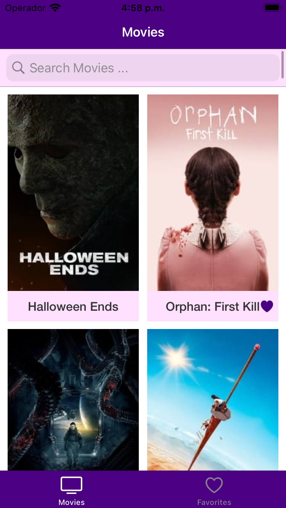
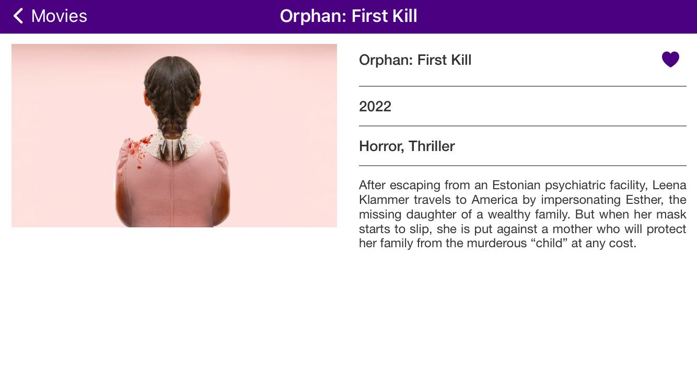
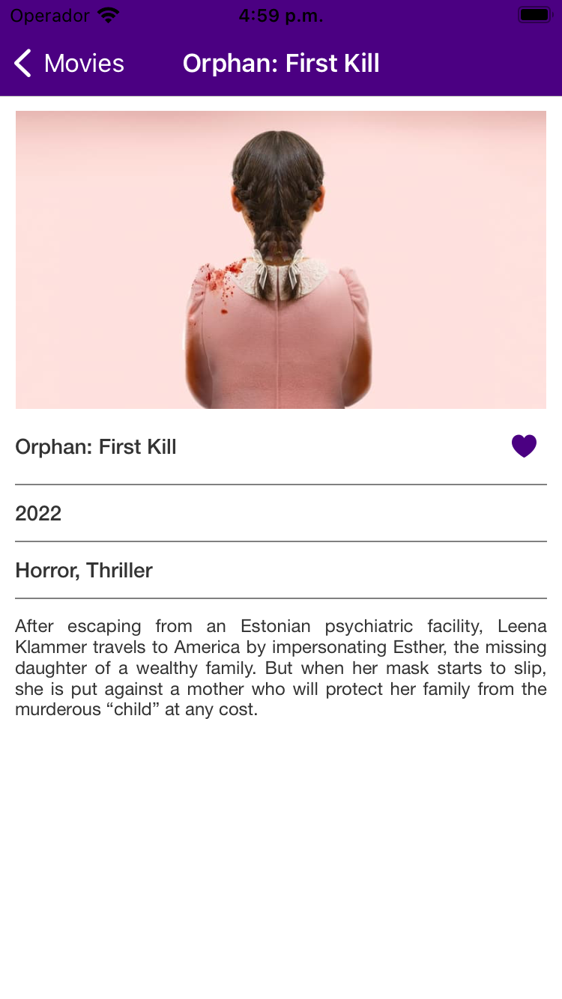
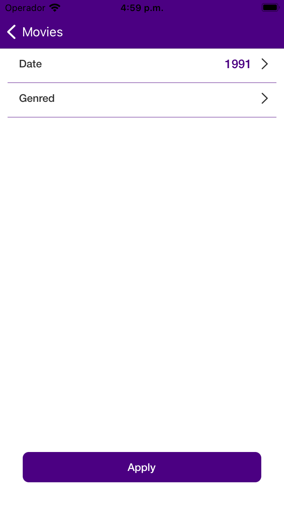
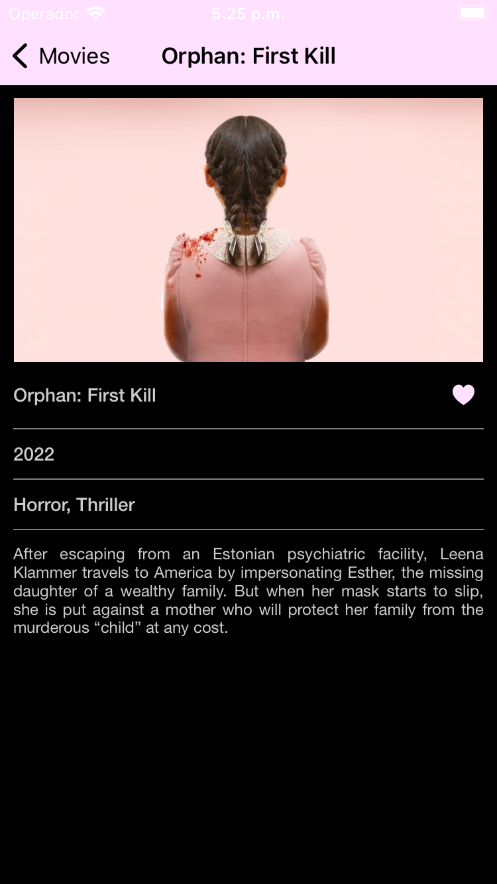
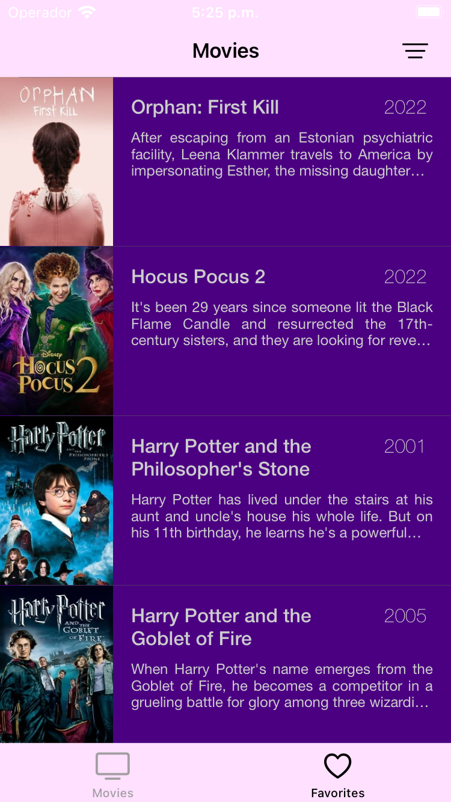
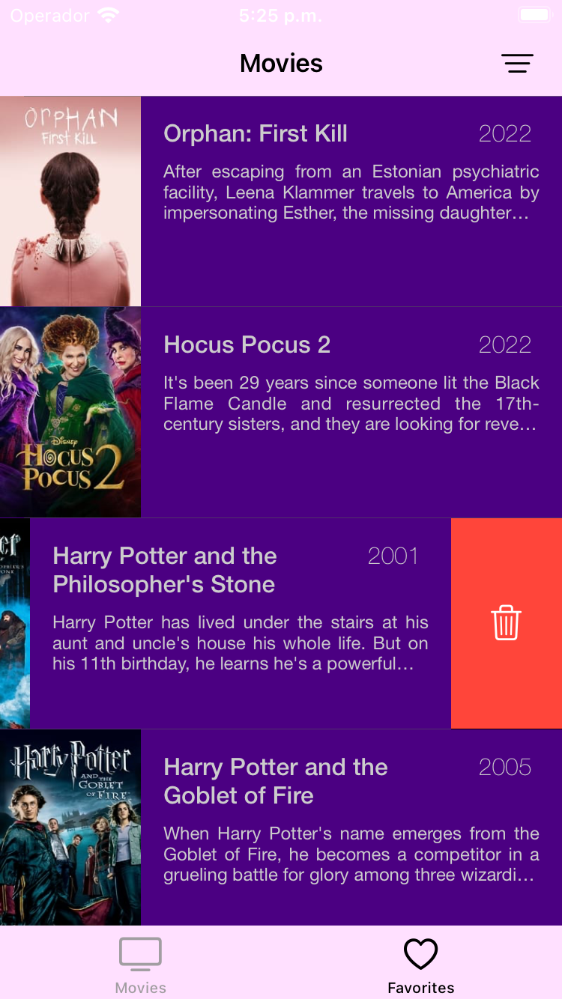
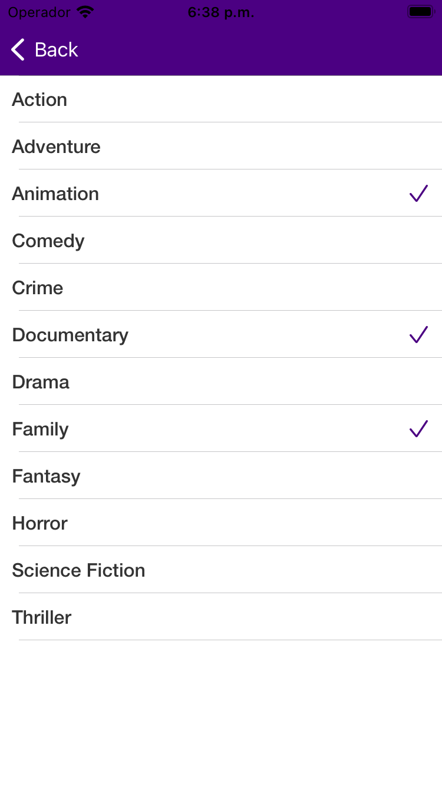
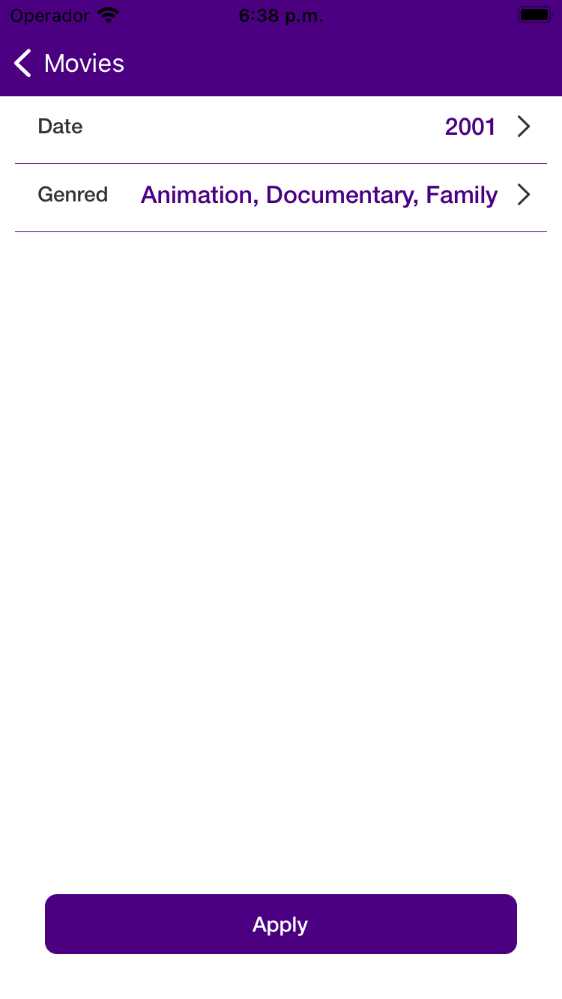

# Concrete iOS Challenge

---

## Información del postulante

### Nombre
Carlos Mario Muñoz Pérez

## Parte 1
- [X] Pantalla de Splash
- [X] Pantalla con una grilla de películas populares. Para ello debes usar esta [API](https://developers.themoviedb.org/3/movies/get-popular-movies)
- [X] Tratamiento de errores y presentación de flujos de excepción:
  - [X] Error genérico
  - [X] Cargando

## Parte 2
- [X] Al hacer clic en una película de la grilla debe dirigirse a la pantalla de detalle de la película. Esta pantalla debe contener:
  - [X] Nombre de la película
  - [X] Año de estreno
  - [X] Sinopsis
  - [X] El nombre del género de la película y no su ID (ej: Action, Horror, etc). Para ello, debes utilizar esta [API](https://developers.themoviedb.org/3/genres/get-movie-list).

## Parte 3

- [X] Selección de películas favoritas
  - [X] La acción para poner como favorita una película debe estar en la pantalla creada en el nivel 2.
  - [X] La información sobre las películas favoritas debe ser persistente, es decir, debe guardarse entre sesiones de la aplicación.
- [X] Lista de películas favoritas:
  - [X] Borrado de películas favoritas desde la lista.
- [X] Layout en pestañas:
  - [X] En la primera pestaña debes mostrarse la pantalla creada en el nivel 1.
  - [X] En la segunda pestaña debes mostrar la lista de películas favoritas.

## Parte 4

- [X] Mejoras a la grilla de películas populares:
  - [X] Scroll infinito.
  - [X] Mostrar si una película es favorita o no en cada celda de la grilla.
  - [X] Búsqueda local (filtrar por algún término).
- [X] Pantalla de filtro con selección de fecha de lanzamiento y género:
  - [X] Sólo debe ser accesible desde la pantalla de favoritos.
  - [X] Al aplicar el filtro, debes volver a la pantalla de favoritos y hacer un filtro local usando la información seleccionada referente a la fecha de lanzamiento y el género.
- [X] Soporte para rotación y iPad.

## Parte 5

- [X] Pruebas unitarias en el proyecto.
- [ ] Pruebas de snapshot.
- [ ] Pruebas de UI.
- [X] Uso de SwiftLint.
- [X] Uso de fastlane para generar binarios.
- [ ] Integración del repositorio con un servicio de integración continua como [Bitrise](https://www.bitrise.io/) o [AppCenter](https://appcenter.ms). No existe problema en usar otra plataforma, pero esta debe estar disponible online (un jenkins local no cuenta).
- [ ] Integración de un servicio de análisis de código como [SonarCloud](https://sonarcloud.io/).

## Flujo de grilla de películas

